# Semantic Segmentation

- This repository is for udacity self-driving car nanodegree project - `Semantic Segmentation`.
- Implement this paper: ["Fully Convolutional Networks for Semantic Segmentation (2015)"](https://people.eecs.berkeley.edu/~jonlong/long_shelhamer_fcn.pdf)
- See [`FCN-VGG16.ipynb`](./FCN-VGG16.ipynb)

## Implementation Details
### Network
`FCN-8s` with `VGG16` as below figure.

### Dataset
- [Kitti Road dataset](http://www.cvlibs.net/datasets/kitti/eval_road.php) from [here](http://www.cvlibs.net/download.php?file=data_road.zip).

### Hyperparameters

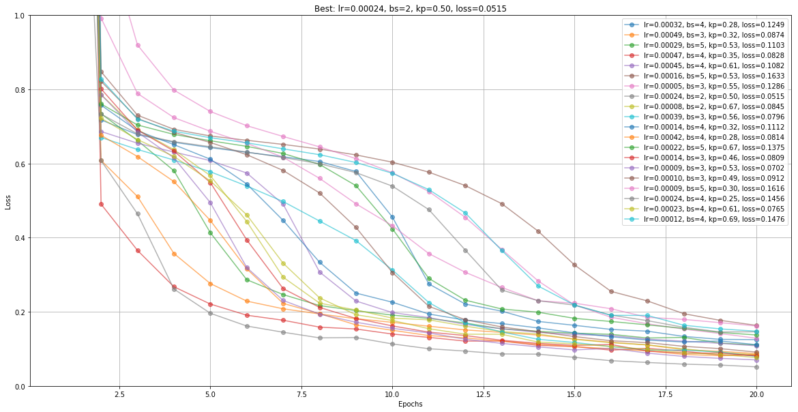

Learning rate, batch size and keep probability was tunned by random search. if you want to see detail: [`Link`](./fcn8s-vgg-tunning-params.ipynb)

- Optimizer: `Adam`
- Learning rate: `0.0002395`
- Deconvolution `l2 regularization` factor: `1e-3`
- Batch size: `2`
- Training epochs: `30`
- `Keep prob` for dropout (VGG): `0.495`

#### 

## Results
### Loss
After 30 epochs, loss became about 0.05

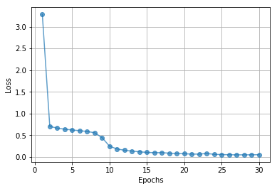

### Nice results
These are pretty nice results. It seems like the network classify road area well.

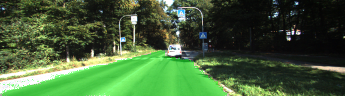
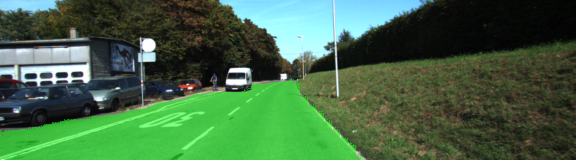
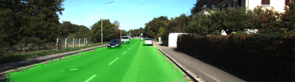
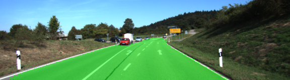
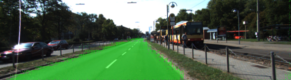
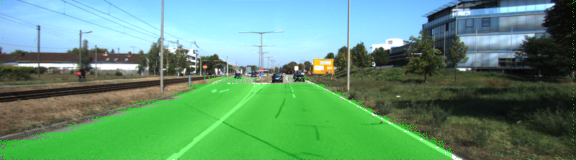
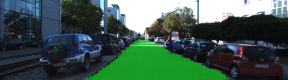

### Bad results
These are bad results. I believe that the results will be better using the following methods.
- Use more deeper network (e.g. ResNet)
- Augment given data or train network with another data (e.g. CityScape)
- Use different architecture (e.g. [U-Net](https://arxiv.org/abs/1505.04597))
- Use post processing (e.g. [CRF(Conditional Random Field)](https://arxiv.org/abs/1210.5644))

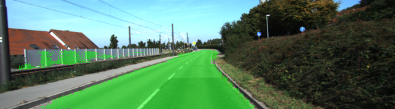
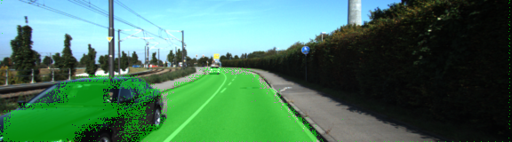
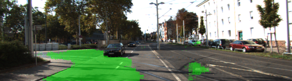
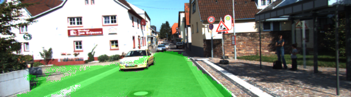

## Setup
#### Frameworks and Packages
Make sure you have the following is installed:
 - [Python 3](https://www.python.org/)
 - [TensorFlow](https://www.tensorflow.org/)
 - [NumPy](http://www.numpy.org/)
 - [SciPy](https://www.scipy.org/)
